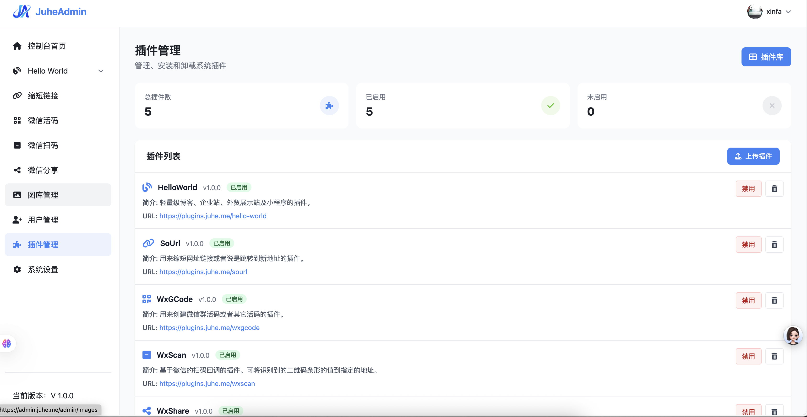
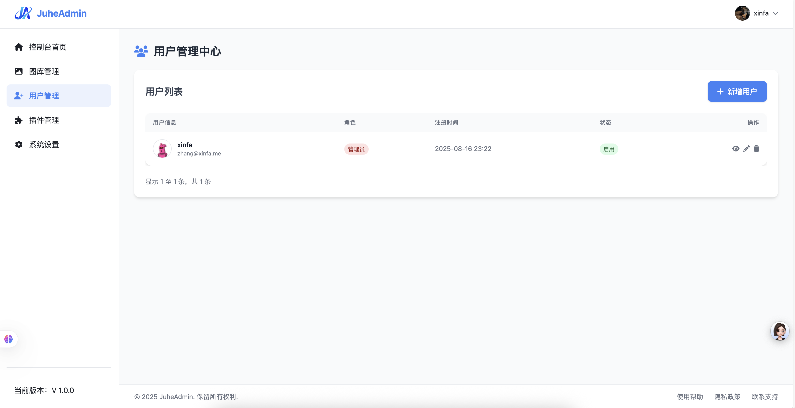

# JuheAdmin 后台管理框架


## 项目简介

JuheAdmin 是一个基于 PHP 的轻量级后台管理框架，采用插件化架构，像积木一样自由组合后台功能，适合快速搭建各类 Web 管理系统。

特点：

* 聚合一切，自由扩展
* 零依赖安装，上传后访问 /install 即可完成安装
* 插件化架构，可按需安装、删除、修改
* 无残留机制，插件卸载自动清理相关表与代码
* 现代化 UI，内置 TailwindCSS 和 Font Awesome
* 轻量数据库层，基于 Medoo 封装
* 多场景支持，企业后台、博客、外贸站、小程序 API、物联网后台等

---

## 框架特性

### 零依赖安装

上传代码后访问 `/install`，填写数据库信息并创建管理员账号即可使用，无需 Composer 依赖。

### 插件化架构

所有功能都以插件形式提供，可自由安装、删除、修改，按需扩展系统功能，保持核心精简。

### 无残留机制

插件卸载时会自动清理相关数据库表和代码，不留垃圾数据，保持系统整洁。

### 现代化 UI

内置 TailwindCSS 和 Font Awesome，界面美观且响应式，适配各种设备屏幕。

### 轻量数据库层

基于 Medoo 封装，API 简洁易用，支持 MySQL、PostgreSQL、SQLite 等多种数据库。

### 多场景支持

适用于企业官网后台、博客系统、外贸站、小程序 API、物联网后台等多种场景。

---

## 系统截图





---

## 快速安装

1. **下载源码**
   从 GitHub 下载最新版本源码或克隆仓库。
2. **上传服务器**
   将代码上传到 Web 服务器目录，确保目录可写。
3. **环境要求**
   PHP >= 8.0，开启 PDO 与 fileinfo 扩展，MySQL 数据库正常运行。
4. **配置伪静态**
   可选择宝塔自带 “ThinkPHP” 伪静态模板  
   或自定义 `.htaccess` 文件  
5. **运行安装**
   访问 `http://your-domain.com/install`，按提示完成安装。
6. **登录使用**
   使用创建的管理员账号登录后台。
7. **安装插件**
   在后台插件管理中安装所需插件，扩展系统功能。

---

## 适用场景

* 企业官网后台：管理产品、新闻、联系方式
* 外贸站管理：订单、客户、产品目录、物流信息
* 博客 / CMS：发布文章、管理评论、分类与标签
* 电商后台：商品、订单、库存、支付管理
* 小程序 API：提供数据接口与业务逻辑
* 物联网后台：管理设备、数据采集与远程控制

---

## 参与贡献

* **提交 Issue**：发现 Bug 或有功能建议？在 GitHub 上提交 Issue
* **提交 PR**：修复问题或添加新功能，提交 Pull Request
* **开发插件**：开发实用插件并分享，丰富 JuheAdmin 生态

---

## 前台引用示例

```html
<header>
    
    
</header>
```

---

## 许可证

本项目使用 **MIT 许可证**。

```
Copyright (c) 2025 juhedev
```

---

## 联系方式

* 微信二维码：`Static/img/qr_wechat.png`
* 邮箱：[admin@juhe.me](mailto:admin@juhe.me)
